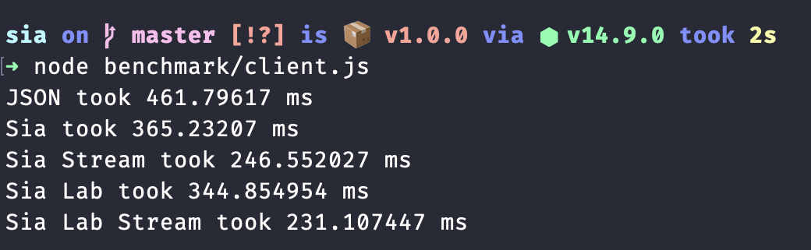

# Sia

Sia - Binary serialisation and deserialisation with built-in compression. You can consider Sia a strongly typed,
statically typed domain specific binary language for building data. Sia preserves data types and supports custom ones.

## Why?

I need a fast schema-less serialization library that preserves the types and can code/decode custom types.
I couldn't find one. At first I wanted to go with a JSON with types solution but it didn't work out, so
I created my own.

## Draft 4 (WIP)

Draft 4 supports streaming, which makes Sia 2-2.5x faster than JSON over network!

## Performance

This repository contains a pure JS implementation of Sia, on our test data we are 20 to 25% faster than JSON
and serialized data (including type information for all entries) is ~15% smaller than JSON. Sia is faster
and smaller than MessagePack and CBOR. Sia can be extremely compact (50-75% smaller than JSON), but it's costly
on dynamically typed languages like JavaScript. On JavaScript checking for byte size of numbers makes the
code +50% slower. On dynamically typed languages it's better and faster to just use LZ4 to compress the data
after encode and decompress before decode, if size matters, it'll still be faster than JSON.

Tests are run on a 2.4 GHz 8-Core Intel Core i9-9980HK CPU (5 GHz while running the benchmarks)
with 64 GB 2667 MHz DDR4 RAM. Node version 14.9.0, Mac OS 10.15.6. 1000 loops each serialization library,
except for CBOR which is painfully slow. To run the benchmarks you can run
`npm run benchmark` and to run the tests you can run `npm run test`. This takes about 40m on my laptop to complete.

I didn't compare this library with Avro or Protocol Buffers, Thrift or others, Sia is completetly schema-less,
yet it preserves the types and reconstructs them, it costs a lot to figure out the schema, keys and data types and to
loop through them, because of that the comparison won't be fair. I'm working on more optimizations, both on the
protocol, data exchange specification and the implementation. If you have any ideas how to improve this,
feel free to post an issue or make a pull request.

## Sia specification - draft 3

This section describes the Sia binary data format. For each piece of item to be serialized,
Sia serializer outputs one or more blocks, these blocks contain the data type preserved in
them and just enough data to reconstruct them.

First 8 bytes of the data (`uint64`) contain the block count (how many blocks in the data). This might be an overkill,
but a few more bytes of meta data won't hurt anyone. Byte 9 is the start of the first block. First byte of each block
determines the type of the block, if the size of the block is defined in the definition next K bytes describe the content
of the block, otherwise a `uint64` immediately after the type byte describes the size of the block.

Draft 3 describes 47 block types, there may be more or less types in future drafts.
You can check their definition and structure [here](./types.md).

### References

Sia supports arrays, hash maps, objects, sets, custom classes, function calls (and more coming in draft 4).
Lets call these complex data types and take array as an example. Sia does not store the array members inside of
the array block, instead they're stored in separate blocks and these blocks are referenced in the array block.

A reference is just the index of a block, it can be a `uint8`, `uint16`, `uint32` or `uint64` depending on how
many blocks are there in the data. So, a `uint8_array` only has references that can fit in a `uint8`, and a
`uint32_array` only has references that can fit in a `uint32` respectively. If possible, the blocks should be
cached and no two values with same serialization should be serialized twice.
