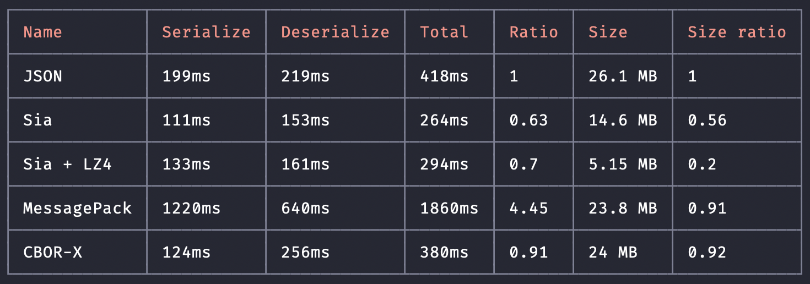

# Sia

Sia - Binary serialisation and deserialisation with built-in compression

## Why?

I need a fast schema-less serialization library that preserves the types and can code/decode custom types.
I couldn't find one. At first I wanted to go with a JSON with types solution but it didn't work out, so
I created my own.

## Performance

This repository contains a pure JS implementation of Sia, on our test data we are about 1.1x slower than JSON,
but serialized data (including type information for all entries) is 40-75% smaller than JSON. Sia is faster
and smaller than MessagePack and CBOR.

Sia Lab, the next draft of Sia (WIP) is about %25 faster than JSON, %15 smaller. Sia Lab has a compact mode which
is slower, but yields in a 50% smaller file, however using LZ4 is faster and yields smaller sizes. Compact mode
makes sense for a language that has static data types, on JavaScript checking for byte size of numbers makes the
code ~50% slower.



Tests are run on a 2.4 GHz 8-Core Intel Core i9-9980HK CPU (5 GHz while running the benchmarks)
with 64 GB 2667 MHz DDR4 RAM. Node version 14.9.0, Mac OS 10.15.6. 1000 loops each serialization library,
except for CBOR which is painfully slow. To run the benchmarks you can run
`npm run benchmark` and to run the tests you can run `npm run test`. This takes about 15m on my laptop to complete.

I didn't compare this library with Avro or Protocol Buffers, Thrift or others, Sia is completetly schema-less,
yet it preserves the types and reconstructs them. I'm working on more optimizations, both on the protocol, data exchange specification and the implementation. If you have any ideas how to improve this, feel free to post an issue or
make a pull request.

## Protocol specification - draft 2

This section describes the Sia binary data format. For each piece of item to be serialized,
Sia serializer outputs one or more blocks, these blocks contain the information
about the constructors of the items and arguments needed for reconstructing them.

At binary and data format level, Sia supports 3 types of blocks, they are:

1. String: To store strings
2. Number: To store numeric values
3. Value: To store any other value

A binary block type is planned.

Each block starts with a block tag, or a signature, this signature is a signed `int8`.
This tag packs the type of the block, byte size of the block and the sign (for numbers):

```JavaScript
SIGNATURE = SIGN * (BLOCK_TYPE + BYTE_SIZE)
```

Table below shows values for block types:

| Block  | Block type value |
| ------ | ---------------- |
| Value  | 0                |
| Number | 10               |
| String | 20               |

### String block

String block is the simplest block in Sia. Byte size can be `1`, `2`, `4` or `8` depending
on the length of the string:

| More than or equal to | Less than      | Byte size | Name    |
| --------------------- | -------------- | --------- | ------- |
| 0                     | 2<sup>8</sup>  | 1         | uint8   |
| 2<sup>8</sup>         | 2<sup>16</sup> | 2         | uint16  |
| 2<sup>16</sup>        | 2<sup>32</sup> | 4         | uint32  |
| 2<sup>32</sup>        | 2<sup>64</sup> | 8         | double  |

Block tag is `10 + BYTE_SIZE`, block structure is:

```
[10 + byte size][string length][      string      ]
<---- int8 ----><- byte size -><- length x uint8 ->
```

Where `10` is the block type for string blocks

### Number block

For number block, byte size depends on the size of the number, with one exception.
Floats always have byte size `8`, for integers refer to table below:

| More than or equal to | Less than      | Byte size | Name    |
| --------------------- | -------------- | --------- | ------- |
| 0                     | 2<sup>8</sup>  | 1         | uint8   |
| 2<sup>8</sup>         | 2<sup>16</sup> | 2         | uint16  |
| 2<sup>16</sup>        | 2<sup>32</sup> | 4         | uint32  |
| 2<sup>32</sup>        | 2<sup>64</sup> | 8         | double  |

Block tag is `20 + BYTE_SIZE`, block structure is:

```
[sign * (20 + byte size)][    number   ]
<-------- int8 ---------><- byte size ->
```

Where `20` is the block type for number blocks

### Value block

Value blocks are very different compared to the other blocks. Sia does not preserve
the structure of your data, unlike JSON, there is no structure, Sia stores enough info
to recreate your data. It is the purpose of the value block to store this information.
This block contains a constructor reference, and an argument reference list.

Before we continue, let's see what are the constructor and argument references. In order
to serialize an item with Sia, we need to reduce it to a number, or a string
(buffer / bin) is planned, these are stored in their corresponding block, and their block
number is referenced in the value block. If a string or a number block with the value we
want already exists and is already serialized, it won't get serialized again. This saves
us some space and computation power.

For a value block, assuming `N` is the maximum of all references and the (argument count + 1),
we can find the byte size depending on `N`, according to the table below:

| More than or equal to | Less than      | Byte size | Name    |
| --------------------- | -------------- | --------- | ------- |
| 0                     | 2<sup>8</sup>  | 1         | uint8   |
| 2<sup>8</sup>         | 2<sup>16</sup> | 2         | uint16  |
| 2<sup>16</sup>        | 2<sup>32</sup> | 4         | uint32  |
| 2<sup>32</sup>        | 2<sup>64</sup> | 8         | double  |

Block tag is `0 + BYTE_SIZE`, block structure is:

```
[0 + byte size][argument count][constructor ref][        argument refs         ]
<--- int8 ----><-- byte size -><-- byte size --><- argument count x byte size ->
```

Where `0` is the block type for value blocks

## Sia data exchange protocol specification - draft 2

Now that we've defined the Sia binary format, we need to define the data exchange protocol,
in other words we should agree how we're going to serialize common data types.

References and numbers are represented as binary, all strings are utf8.

The Sia data exchange protocol supports 9 basic data types, two of which have their own dedicated block types:

1. Number: represented in a number block
2. String: represented in a string block

The rest are value blocks:

| Constructor | Arguments                                                          |
| ----------- | ------------------------------------------------------------------ |
| Array       | Refs to other blocks, can be any of value, string or number blocks |
| Boolean     | `"false"` for `false`, `"true"` for `true` *                       |
| Date        | Numeric value of unix timestamp                                    |
| Null        | No arguments                                                       |
| Object      | Regs to other blocks, in form of `key1 value1 key2 value2...`      |
| Regex       | Refs to two other blocks: source and flags                         |
| Undefined   | No arguments                                                       |

* Using `0` for `false` and `1` for `true` increases the size significantly.